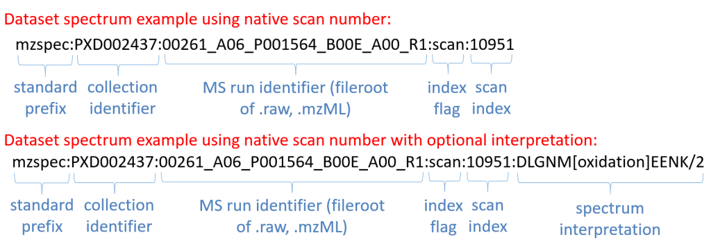

Get Spectra using list of USIs
===============================

USI(universal spectrum identifier) is a unique representation for a mass spectrum within a resource or a dataset `Documentation <http://www.psidev.info/usi>`_. In summary, a USI is a combination of a dataset accession or collection (e.g. spectral library); a file within that collection and an scan or index number withing the file. Inm addition, the USI can contains the information about the peptide sequence and PTMs.

If you want to know more about USI, `USI Specification <http://www.psidev.info/usi>`_.

Swagger
-------
https://www.ebi.ac.uk/pride/multiomics/ws/swagger-ui/index.html?url=/pride/multiomics/ws/api-docs&configUrl=/pride/multiomics/ws/api-docs/swagger-config#/Spectra/findByMultipleUsisSse

OR

https://www.ebi.ac.uk/pride/multiomics/ws/swagger-ui/index.html?url=/pride/multiomics/ws/api-docs&configUrl=/pride/multiomics/ws/api-docs/swagger-config#/Spectra/findByMultipleUsisStream

Curl
-----
.. code-block:: bash

   curl -X POST "https://www.ebi.ac.uk/pride/multiomics/ws/spectra/sse/findByMultipleUsis" -H "accept: */*" -H "Content-Type: application/json" -d '["NIST:cptac2_human_hcd_itraq_selected_part1_2015.msp:index:80003","NIST:cptac2_human_hcd_itraq_selected_part1_2015.msp:index:80016"]'

   OR

   curl -X POST "https://www.ebi.ac.uk/pride/multiomics/ws/spectra/stream/findByMultipleUsis" -H "accept: */*" -H "Content-Type: application/json" -d '["NIST:cptac2_human_hcd_itraq_selected_part1_2015.msp:index:80003","NIST:cptac2_human_hcd_itraq_selected_part1_2015.msp:index:80016"]'

Python sample code
------------------

Using SSEs
***********

.. note::
   pip install sseclient-py

.. code-block:: python

   from sseclient import SSEClient   #pip install sseclient-py
   import requests

   url = 'https://www.ebi.ac.uk/pride/multiomics/ws/spectra/sse/findByMultipleUsis'
   headers = {"Content-Type": "application/json"}
   data = '["NIST:cptac2_human_hcd_itraq_selected_part1_2015.msp:index:80003","NIST:cptac2_human_hcd_itraq_selected_part1_2015.msp:index:80016"]'

   def main():
       response = requests.post(url, data=data, headers=headers, stream=True)
       if response.status_code != 200:
           text = str(response.status_code) + ': ' + response.text
           raise Exception(text)
       client = SSEClient(response)
       for event in client.events():
           if event.event.lower() == "spectrum":
               print(event.data)
           elif event.event.lower() == "done":
               client.close()
               break

   if __name__ == "__main__":
       main()

Using Stream
*************

.. code-block:: python

   import requests

   url = 'https://www.ebi.ac.uk/pride/multiomics/ws/spectra/stream/findByMultipleUsis'
   headers = {"Content-Type": "application/json"}
   data = '["NIST:cptac2_human_hcd_itraq_selected_part1_2015.msp:index:80003","NIST:cptac2_human_hcd_itraq_selected_part1_2015.msp:index:80016"]'

   def main1():
       response = requests.post(url, data=data, headers=headers, stream=True)
       if response.status_code != 200:
           text = str(response.status_code) + ': ' + response.text
           raise Exception(text)
       for line in response.iter_lines():
           if line:
               print(line)

   if __name__ == "__main__":
       main1()
