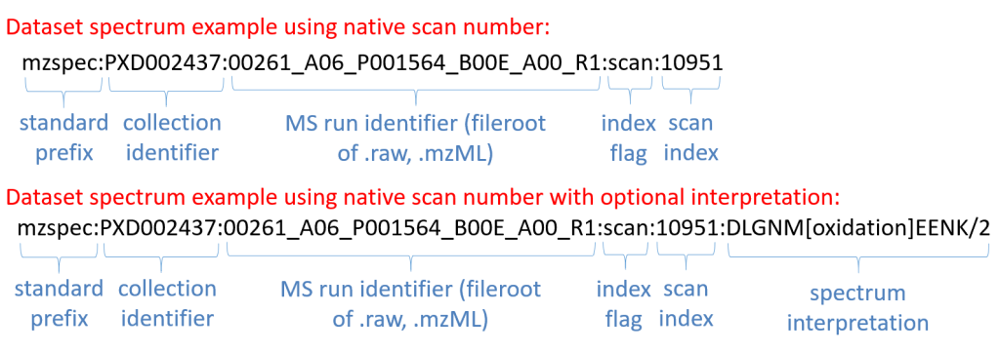

Get Spectrum using USI
=======================

A universal spectrum identifier is a unique representation for a mass spectrum within a resource or a dataset `Documentation <http://www.psidev.info/usi>`_. In summary, a USI is a combination of a dataset accession or collection (e.g. spectral library); a file within that collection and an scan or index number withing the file. Inm addition, the USI can contains the information about the peptide sequence and PTMs.

If you want to know more about USI, `USI Specification <http://www.psidev.info/usi>`_.

Swagger
-------
https://www.ebi.ac.uk/pride/multiomics/ws/swagger-ui/index.html?url=/pride/multiomics/ws/api-docs&configUrl=/pride/multiomics/ws/api-docs/swagger-config#/Spectra/findByUsi

Curl
-----
.. code-block:: bash

   curl -X GET "https://www.ebi.ac.uk/pride/multiomics/ws/spectra/findByUsi?usi=NIST%3Acptac2_human_hcd_itraq_selected_part1_2015.msp%3Aindex%3A80003" -H "accept: */*"

Python sample code
------------------
.. code-block:: python

   import requests

   def main():
    url = 'https://www.ebi.ac.uk/pride/multiomics/ws/spectra/findByUsi?usi=NIST:cptac2_human_hcd_itraq_selected_part1_2015.msp:index:80003'
    response = requests.get(url)
    if response.status_code != 200:
      text = str(response.status_code) + ': ' + response.text
      raise Exception(text)

   print(response.text)

   if __name__ == "__main__":
    main()
